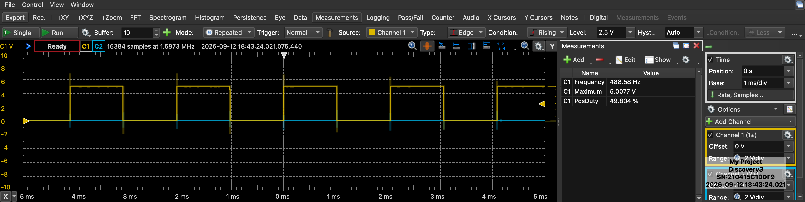
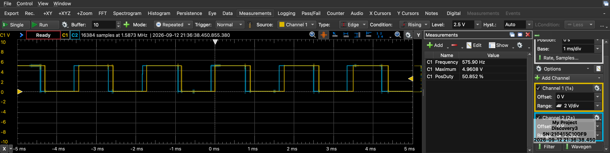

# Closed-Loop DC Motor Speed Control System

A closed-loop brushed DC motor speed-control project built around an ATmega328-based Arduino-compatible board, DRV8871 H-bridge motor driver, and JGA25-370 gearmotor with quadrature encoder.

The project progressed from basic open-loop PWM control through encoder characterization, RPM measurement, proportional feedback, PI tuning, and final closed-loop performance testing.

The final controller uses **PI feedback** and supports signed forward/reverse RPM commands.

---

## Final Hardware Setup

The completed test setup uses:

- ATmega328-based Arduino-compatible board
- JGA25-370 12 V DC gearmotor
- Integrated quadrature encoder
- DRV8871 motor driver
- 12 V / 2 A external power supply
- Temporary helping-hands fixture for securing the motor and electronics


---

## Project Goals

The main goals of the project were to:

- Control a brushed DC motor using PWM
- Measure shaft speed using a quadrature encoder
- Determine encoder counts per output-shaft revolution
- Characterize the relationship between PWM duty cycle and RPM
- Implement signed bidirectional closed-loop speed control
- Compare proportional-only control with PI control
- Reduce steady-state speed error
- Measure rise time, settling time, overshoot, and steady-state error
- Test controller response to an external mechanical disturbance
- Document the system using logged data, plots, scope captures, and experimental results

---

## Hardware

### Motor

**JGA25-370**

- Rated voltage: 12 V
- Rated output speed: approximately 150 RPM
- Integrated quadrature encoder
- Encoder supply: 3.3–5 V

Motor/encoder wiring:

| Wire | Function |
| --- | --- |
| Red | Motor + |
| White | Motor - |
| Blue | Encoder VCC |
| Black | Encoder GND |
| Yellow | Encoder Channel A |
| Green | Encoder Channel B |

### Motor Driver

**DRV8871 H-bridge module**

The driver allows PWM speed control and bidirectional motor operation.

### Controller

ATmega328-based Arduino-compatible board programmed using PlatformIO and the Arduino framework.

### Power

- Motor supply: 12 V / 2 A
- Arduino powered separately through USB
- Arduino, encoder, and DRV8871 use a common ground

---

## Pin Assignment

| Arduino Pin | Function |
| --- | --- |
| D2 | Encoder Channel A |
| D3 | Encoder Channel B |
| D9 | DRV8871 IN1 / PWM |
| D10 | DRV8871 IN2 / PWM |
| 5V | Encoder VCC |
| GND | Encoder GND / common ground |

---

## Development Stages

- [x] Stage 1 — PlatformIO setup and hardware identification
- [x] Stage 2 — Open-loop PWM motor control
- [x] Stage 3 — Quadrature encoder verification
- [x] Stage 4 — RPM measurement
- [x] Stage 5 — PWM-to-RPM characterization
- [x] Stage 6 — RPM noise analysis
- [x] Stage 7 — Proportional closed-loop control
- [x] Stage 8 — PI control and tuning
- [x] Final closed-loop characterization
- [x] Mechanical disturbance test

---

## Open-Loop PWM Control

The motor was first operated without feedback to verify the driver, direction control, and PWM signal.

Serial commands were used to select PWM levels and direction.

A 50% PWM waveform was verified with a Digilent Analog Discovery 3.

Measured PWM frequency was approximately **489 Hz**.



---

## Quadrature Encoder Verification

The encoder channels were inspected with the Analog Discovery 3.

Both channels produced clean digital waveforms with the expected quadrature phase offset.



The encoder resolution was measured experimentally by manually counting multiple output-shaft revolutions.

Two clean measurements produced approximately:

- 49,920 counts / 20 revolutions = 2,496 counts/revolution
- 50,038 counts / 20 revolutions = 2,501.9 counts/revolution

The firmware therefore uses:

**2500 counts per output-shaft revolution**

for RPM calculations.

---

## RPM Measurement

RPM is calculated every 200 ms from the change in encoder count:

```text
RPM = (deltaCount / countsPerRev) * (60000 / sampleTimeMs)