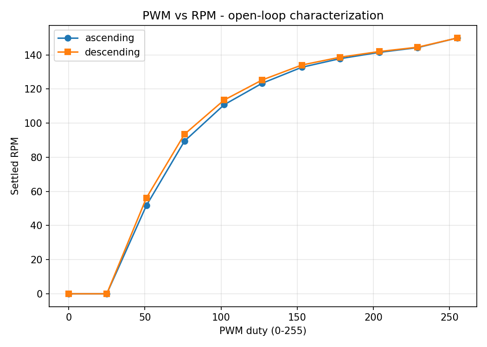

# Closed-Loop DC Motor Speed Control

A brushed DC motor speed-control project using an Arduino-compatible ATmega328 board, a DRV8871 motor driver, and a quadrature encoder.

The goal is to build the project in stages: first characterize the motor in open loop, then use encoder feedback to implement and compare P, PI, and possibly PID speed control.

The project currently has working open-loop motor control, quadrature encoder feedback, RPM measurement, serial data logging, and PWM-vs-RPM characterization.

## Current Status

Completed so far:

- Motor and driver hardware identified
- DRV8871 motor driver wired and tested
- Open-loop PWM speed and direction control
- Quadrature encoder signals verified with an oscilloscope
- Interrupt-based x4 encoder decoding
- Measured encoder resolution
- Signed RPM measurement
- CSV serial data logging
- Full ascending and descending PWM-vs-RPM sweep
- Open-loop speed-response analysis

Closed-loop control is the next major part of the project.

## Hardware

- JGA25-370 12 V brushed DC gearmotor
- Integrated quadrature encoder
- DRV8871 H-bridge motor driver
- Whadda / Velleman ATmega328 UNO-compatible board
- 12 V, 2 A power supply
- Digilent Analog Discovery 3
- Digital multimeter
- Breadboard and jumper wiring

## Pin Assignment

| Arduino Pin | Function |
|---|---|
| D2 | Encoder A — Yellow |
| D3 | Encoder B — Green |
| D9 | DRV8871 IN1 |
| D10 | DRV8871 IN2 |
| 5V | Encoder VCC — Blue |
| GND | Encoder GND / common driver ground |

The DRV8871 is powered separately from the 12 V motor supply.

## Project Stages

- [x] 1. Hardware identification and wiring
- [x] 2. Open-loop PWM motor control
- [x] 3. Quadrature encoder bring-up
- [x] 4. RPM measurement
- [x] 5. Open-loop PWM vs. RPM characterization
- [ ] 6. Velocity filtering, if justified by measurements
- [ ] 7. Proportional control
- [ ] 8. PI control
- [ ] 9. PID evaluation
- [ ] 10. Step-response and disturbance testing

## Open-Loop Motor Control

The motor is controlled through the DRV8871 using two Arduino PWM-capable outputs.

Current serial commands:

| Command | Action |
|---|---|
| `0`–`9` | Set approximately 0–90% PWM duty |
| `f` | 100% duty |
| `s` | Stop / coast |
| `d` | Stop and flip direction |

The motor successfully runs in both directions and stops cleanly.

At full duty, the unloaded motor measured approximately **149–150 RPM**, closely matching its 150 RPM rating.

## PWM Verification

Before connecting the motor, the PWM outputs were checked with the Analog Discovery 3.

At command `5`:

- Frequency: approximately **488.6 Hz**
- Duty cycle: approximately **49.8%**
- Logic high: approximately **5.0 V**


## Quadrature Encoder

Encoder connections:

| Encoder Wire | Function |
|---|---|
| Blue | 5 V |
| Black | GND |
| Yellow | Encoder A / D2 |
| Green | Encoder B / D3 |

The encoder signals were checked on the Analog Discovery 3 before connecting them to the Arduino interrupt pins.

Both channels produced clean approximately 0–5 V square waves with a clear quadrature phase offset.

No external pull-up resistors were required.


## Encoder Resolution

The output-shaft encoder resolution was measured experimentally.

Two 20-revolution tests produced:

- 49,920 counts / 20 rev = **2496.0 counts/rev**
- 50,038 counts / 20 rev = **2501.9 counts/rev**

The firmware therefore uses:

**2500 counts per output-shaft revolution**

with x4 quadrature decoding.

## RPM Measurement

RPM is calculated from the change in encoder count over a fixed sampling window.

Verified measurements:

| Test | Measured Speed |
|---|---:|
| Motor stopped | 0.0 RPM |
| Command `2`, reverse | about -55 RPM |
| Command `5` | about 124 RPM |
| Full duty `f` | about 149–150 RPM |

The RPM sign also correctly changes when motor direction is reversed.

## PWM vs. RPM Characterization

A full open-loop sweep was performed from duty 0 to 255 and back down to 0.

Each duty level was held for approximately 4 seconds while RPM data was logged automatically.

Raw data:

`data/stage5_pwm_sweep.csv`

Logger:

`analysis/log_serial.py`

Analysis:

`analysis/analyze_stage5.py`

### Ascending Sweep

| Duty | Settled RPM |
|---:|---:|
| 0 | 0.00 |
| 25 | 0.00 |
| 51 | 51.72 |
| 76 | 89.46 |
| 102 | 110.76 |
| 127 | 123.36 |
| 153 | 132.72 |
| 178 | 137.76 |
| 204 | 141.48 |
| 229 | 144.24 |
| 255 | 149.88 |



### Main Observations

The motor remained stopped at duty 25 and was running by duty 51, placing the startup threshold somewhere between those two values.

The duty-to-speed relationship is strongly nonlinear. Around 50% PWM already produces about 82% of the measured maximum speed.

The curve also becomes much flatter at higher PWM values as the motor approaches its unloaded maximum speed.

A small amount of hysteresis was measured between the ascending and descending sweeps. The difference was largest at low duty and became very small near full speed.

More detail is available in:

`docs/stage5-characterization.md`

## Data Logging

Serial output is formatted as CSV:

```text
millis,duty,count,rpm